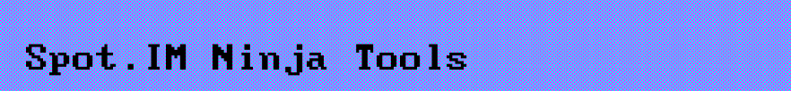

## Develop

Run:

```
yarn start
```

Then visit http://localhost:5732/spotim-ninja-tools.user.js and install the script.

You'll see the following repeatedly spat out to the console:

```
Invalid Host/Origin header
[WDS] Disconnected!
```

Ignore it.

Whenever you make changes to the source, update the userscript through Tampermonkey.

After you're done developing, re-install the script from [Github](https://github.com/SpotIM/userscripts/raw/master/spotim-ninja-tools.user.js).

## Updating the Release Notes (or What's New)

We don't want people using this userscript to be constantly bombarded with "What's New" screens.

When releasing small updates (i.e., ones that fix some bugs or makes some minor change) please refrain from updating the [release notes](./src/whats-new.ts).

When making big, front facing changes, ones that are reflected in the UI (i.e., adding commands) add a short, one line release note.

Let's keep this userscript as frictionless as possible from the user's point of view.

## Publish

Bump version in `package.json` and run:

```
yarn build
```

And just push the changes (Tampermonkey pulls updates from this repo on a daily basis).
